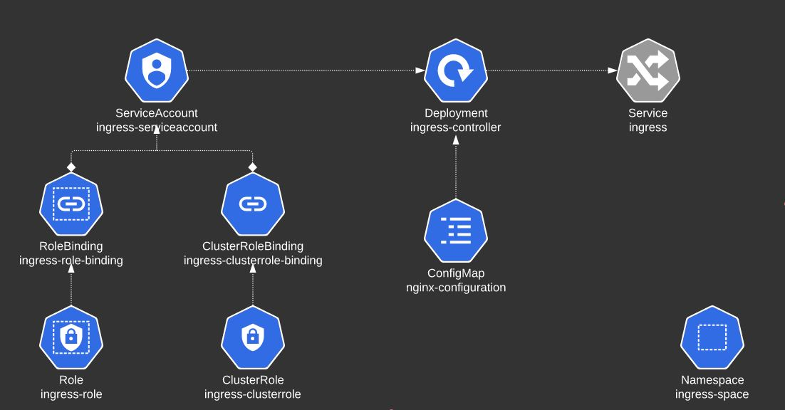

## You are requested to change the URLs at which the applications are made available.


```

apiVersion: networking.k8s.io/v1
kind: Ingress
metadata:
  annotations:
    nginx.ingress.kubernetes.io/rewrite-target: /
    nginx.ingress.kubernetes.io/ssl-redirect: "false"
  creationTimestamp: "2022-12-30T14:03:20Z"
  generation: 1
  name: ingress-wear-watch
  namespace: app-space
  resourceVersion: "1386"
  uid: c4a2dffe-14ac-45cf-8f50-e09006976207
spec:
  rules:
  - http:
      paths:
      - backend:
          service:
            name: wear-service
            port:
              number: 8080
        path: /wear
        pathType: Prefix
      - backend:
          service:
            name: video-service
            port:
              number: 8080
        path: /watch
        pathType: Prefix
      - backend:
          service:
            name: video-service
            port:
              number: 8080
        path: /stream
        pathType: Prefix
```


```
apiVersion: networking.k8s.io/v1
kind: Ingress
metadata:
  name: minimal-ingress
  namespace: critical-space
  annotations:
    nginx.ingress.kubernetes.io/rewrite-target: /
spec:
  rules:
  - http:
      paths:
      - path: /pay
        pathType: Prefix
        backend:
          service:
            name: pay-service
            port:
              number: 8282


```


## Manuall install of IngressController

```

k create ns ingress-space
k create configmap -n ingress-space nginx-configuration
k create serviceaccount ingress-serviceaccount -n ingress-space 
```

ingress-controller.yaml
```
---
apiVersion: apps/v1
kind: Deployment
metadata:
  name: ingress-controller
  namespace: ingress-space
spec:
  replicas: 1
  selector:
    matchLabels:
      name: nginx-ingress
  template:
    metadata:
      labels:
        name: nginx-ingress
    spec:
      serviceAccountName: ingress-serviceaccount
      containers:
        - name: nginx-ingress-controller
          image: quay.io/kubernetes-ingress-controller/nginx-ingress-controller:0.21.0
          args:
            - /nginx-ingress-controller
            - --configmap=$(POD_NAMESPACE)/nginx-configuration
            - --default-backend-service=app-space/default-http-backend
          env:
            - name: POD_NAME
              valueFrom:
                fieldRef:
                  fieldPath: metadata.name
            - name: POD_NAMESPACE
              valueFrom:
                fieldRef:
                  fieldPath: metadata.namespace
          ports:
            - name: https
              containerPort: 443
            - name: http
              containerPort: 80
```

## Let us now create a service to make Ingress available to external users.
```
kubectl expose -n ingress-space deployment ingress-controller --type=NodePort --port=80 --name=ingress --dry-run=client -o yaml
add namespace and nodeport

apiVersion: v1
kind: Service
metadata:
  labels:
    app: ingress
  name: ingress
  namespace: ingress-space
spec:
  ports:
  - name: 80-80
    port: 80
    protocol: TCP
    targetPort: 80
    nodePort: 30080
  type: NodePort
  selector:
    name: nginx-ingress 
status:
```


## Create the ingress resource to make the applications available at /wear and /watch on the Ingress service.
```
apiVersion: networking.k8s.io/v1
kind: Ingress
metadata:
  name: minimal-ingress
  namespace: app-space
  annotations:
    nginx.ingress.kubernetes.io/rewrite-target: /
    nginx.ingress.kubernetes.io/ssl-redirect: "false"

spec:
  rules:
  - http:
      paths:
      - path: /wear
        pathType: Prefix
        backend:
          service:
            name: wear-cat
            port:
              number: 8080
      - path: /watch
        pathType: Prefix
        backend:
          service:
            name:  video-service
            port:
              number: 8080

```